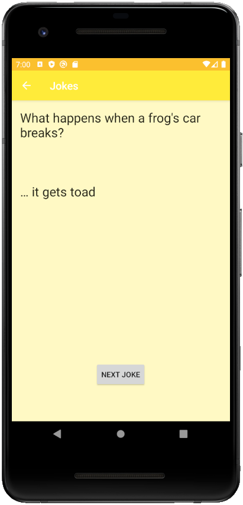

# Android Weekly Series

Welcome to the Android Weekly Series hosted by Google's Developer Student Club (DSC) program!

This is a ten week workshop series every Saturday, 1:30 - 3:30 EST from July 11, 2020 to Sept 12, 2020.

This series will cover all the essential skills needed to build professional, robust, and attractive Android apps.

Register now on EventBrite: [register.dsclsu.com/android](https://register.dsclsu.com/android)  
More info on: [www.dsclsu.com/android](https://www.dsclsu.com/android)

## 5. Random Joke App

Life gets hard sometimes. Unwind with some jokes from your random jokes app!

### Screenshots (Gif with English and German)
 

 
 

### Screenshots (Png English)
 

 

 

 

 
 

### Screenshots (Png German)
 

 

 

 

 
 

### Skills Learned

* Keeping strings in strings.xml
  * Localization: App in different languages
* Resource qualifiers
* Multi-screen apps using Intent
* Modifying ActionBar
  * Changing the title
  * Adding back button
